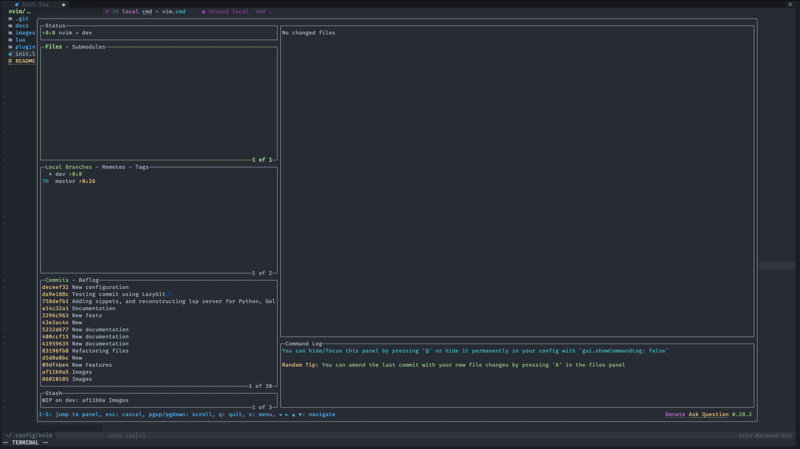
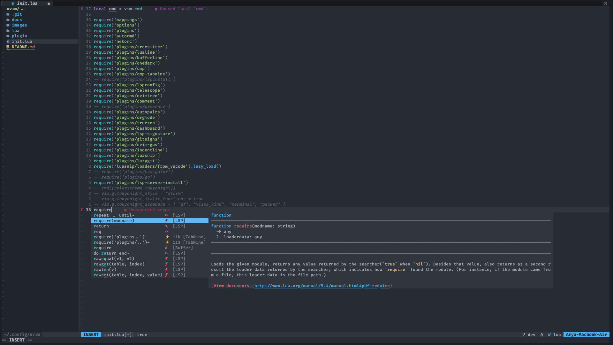
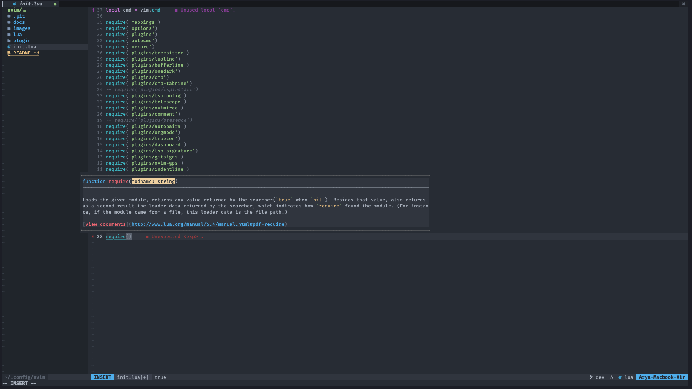
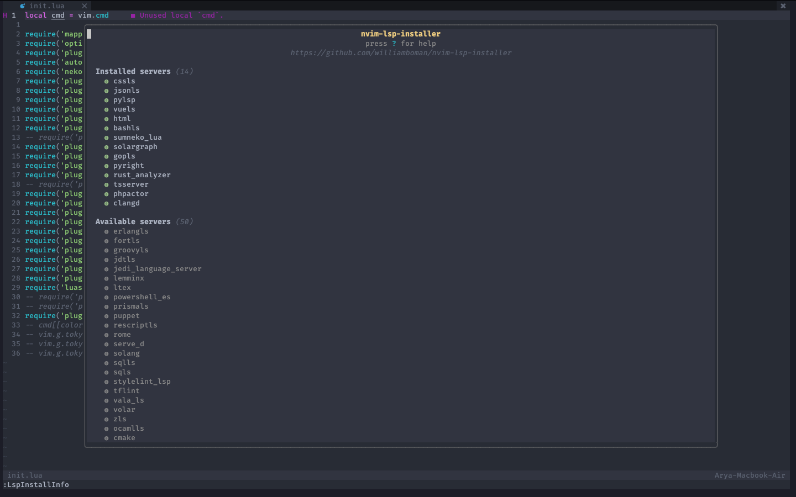

<h1 align="center">🐱 Neko Vim (Nvim) 🐱</h1>


</img>

<div align="center">

[](https://lua.org)

</div>

<div align="center">
 <a href="https://github.com/AyaWcksn/Neko-Vim/tree/master#installation"> Installation 💻 </a>
 <span>  </span>
 <a href="https://github.com/AyaWcksn/Neko-Vim/blob/master/docs/KEYMAPS.md"> Keymaps ⌨️ </a>
</div>

Neovim distribution created by Lua programming language  
Why i'm using Neko as name? It's simple because when it combine, the name turns into Nvim haha! (damn weebs)

## Installation 💻 

- Linux and MacOS 
  
``` shell
cd .config  
mv nvim nvim.bak  
git clone https://github.com/AyaWcksn/neovim-configuration.git nvim
```

``` shell
nvim +PackerSync
```

- Windows
   
``` cmd
cd %userprofile%\AppData\Local\nvim
del /s /q *
for /f "delims=" %x in ('dir /b /ad .') do rd /s /q "%x"
```

``` cmd
cd %userprofile%\AppData\Local
git clone https://github.com/AyaWcksn/neovim-configuration nvim
```

## Features 🔥

- Depedencies :
  - NodeJs 
  - Pip
  - Python

- Features :
  - Lsp for Golang, Python, Javascript, Typescript, Php, Bash, Html, Css, C, C++
  - Live grep
  - Git integration 
  - Org mode and Vim wiki for note taking
  - Images using Telescope
  - Termux integration

## How to use ❓

It's just basic typical neovim configuration just like other  
Y for copy whole line, y for copy, p for paste, h/j/k/l for movement, etc  
You can refer to this [mapping](./docs/KEYMAPS.md) page for specifics commands mapping keys  

## Screenshoots 📸

- Git

</img>

I'm using [LazyGit](https://github.com/jesseduffield/lazygit) for my git related stuff  
Cherry-picking, commits, push, pull, etc

- LSP

</img>

I'm using [vim-cmp](https://github.com/hrsh7th/nvim-cmp) as completion plugin  
and [Luasnip](https://github.com/L3MON4D3/LuaSnip) as snippet plugin  
also with [friendly-snippets](https://github.com/rafamadriz/friendly-snippets) for my snippets management

</img>

There's also included [Lsp-signature](https://github.com/ray-x/lsp_signature.nvim) for nice touch in the code!

- LSP Language
 
</img>

For the language server, i'm using [nvim-lsp-installer](https://github.com/williamboman/nvim-lsp-installer), you can look at there how to install language server

## Future development 🌍

| Feature                    | Status   |
|----------------------------|----------|
| Debugging                  | Progress |
| Work in termux and windows | Done     |

