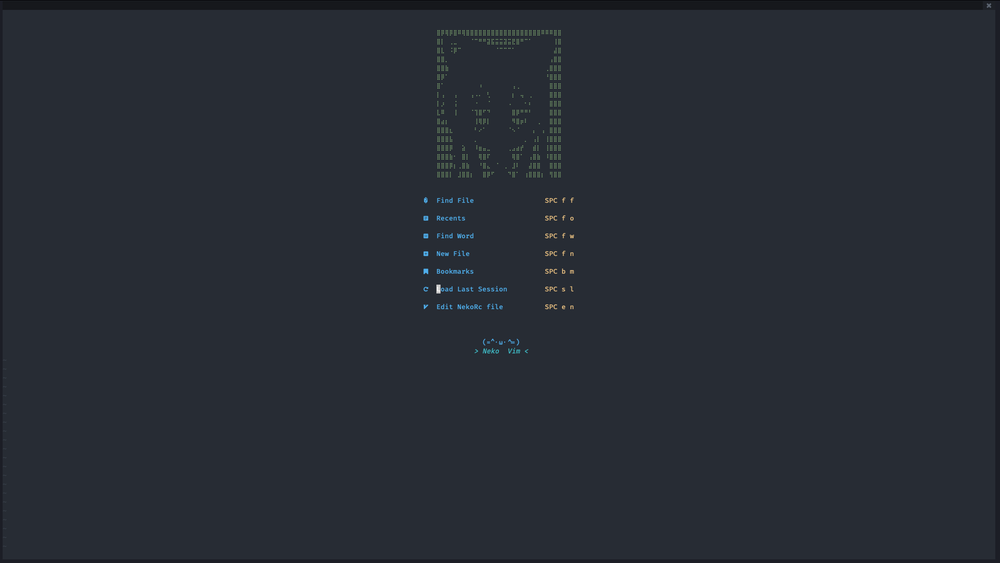

<h1 align="center">🐱 Neko Vim (Nvim) 🐱</h1>


</img>


## Installation

- Linux and MacOS 
  
``` shell
cd .config && mv nvim nvim.bak && git clone https://github.com/AyaWcksn/neovim-configuration.git nvim
```

``` shell
nvim +PackerSync
```

- Windows
   
``` cmd
cd %userprofile%\AppData\Local\nvim
del /s /q *
for /f "delims=" %x in ('dir /b /ad .') do rd /s /q "%x"
```

``` cmd
cd %userprofile%\AppData\Local
git clone https://github.com/AyaWcksn/neovim-configuration nvim
```

## Features

- Depedencies :
  - NodeJs 
  - Pip
  - Python

- Features :
  - Lsp for Golang, Python, Javascript, Typescript, Php, Bash, Html, Css, C, C++
  - Live grep
  - Git integration 
  - Org mode and Vim wiki for note taking
  - Images using Telescope
  - Termux integration

